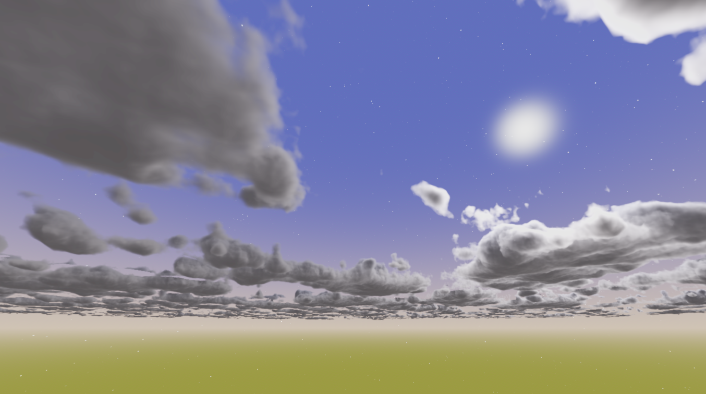

+++
title = 'Volumetric clouds for stylized project'
date = 2025-11-20
draft = false
summary = "WIP real-time volumetric cloud rendering for game project."
tags = ['Graphics', 'Personal Project']
+++
Early work in progress cloud rendering and modelling, based on cloud technology used in games such as Horizon: Zero Dawn, Red Dead Redemption 2, and the Frostbite engine.
Raymarches through a combination of noise textures, gathering light and absorption along the way.
Uses various lighting techniques from these to approximate scattering, e.g. using a dual lobe henyey greenstein and powder effect.

Currently running in real time at native resolution on a 9070xt due to a conservative use of samples, further work will be to further reduce necessary samples by better skipping empty sections of noise, and spatial and temporal upscaling, to allow it to run on as many devices as possible.

