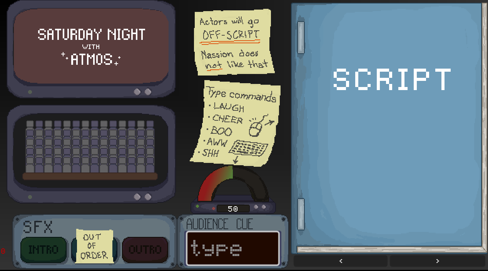
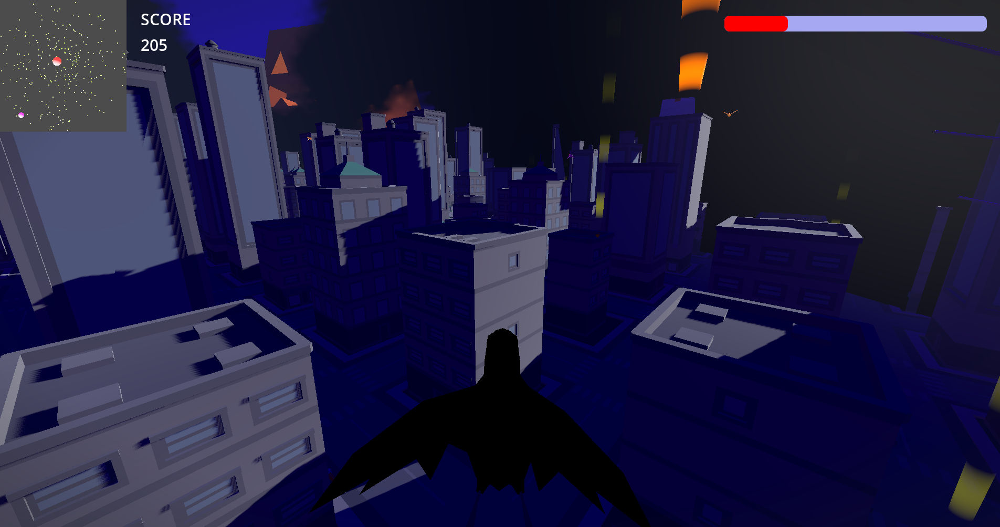
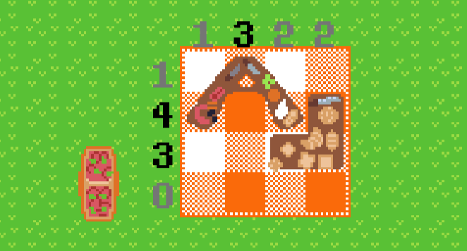
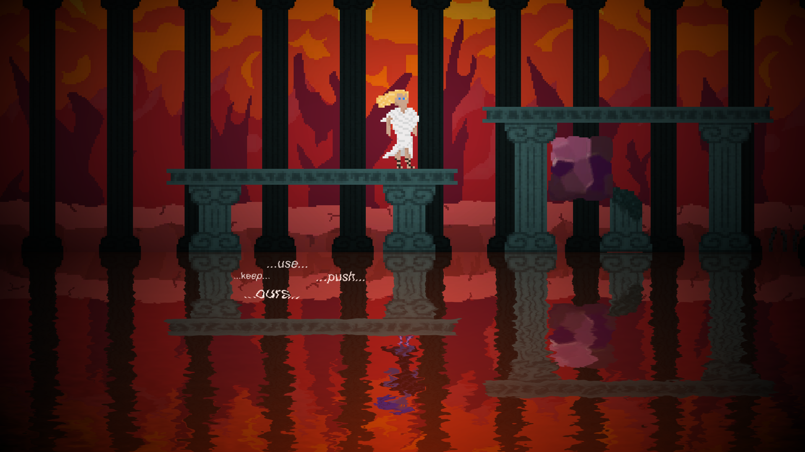
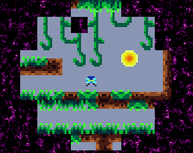

+++
title = 'Game Jams'
date = 2024-01-28
draft = false
summary = "Overview of selected game jams, all made in less than 72 hours, solo or in teams."
tags = ['Game Development', 'Personal Project']
+++



Finite Monkey Theorem was a runner up at the local section of the 48 hour Global Game Jam Gothenburg 2024. I had very limited time for this game jam, so I focused my limited time on tooling and minor improvements and fixes. 
Most notably, I desgined and implemented a system for easily and quickly annotating an audio track, which is important as the games mechanic relies on playing certain sound effects during a broadcast by typing, which can have different effects on the game depending on what is being said.
I did this by figuring out Audacity allows inserting exportable markers, and creating a script in engine to parse the exported audacity markers in the game. I finished this very early, providing the tech foundation needed to make the game, letting others fully develop the game as i had to go away for most of the jam.
The audio marker system worked out well, as we were able to get all the required voice acting recorded and quickly annotated in the final hours of the jam with limited issues. [Available on Itch.](https://edneedsbread.itch.io/finite-monkey-theorem)

Crowley won most fun award at an on premises 48 hour game jam at a University with a team of 5. I collaborated with another member of the team in creating the flight controller, and worked on the enemy system. Goal was flying around the procedurally generated collecting objectives, bringing them home, while avoiding enemies. A lot of my focus was making the flight satisfying but easy to pick up and learn, and creating friction in the form of enemies. [Available on Itch.](https://raul-martin.itch.io/crowley)

Picnicross was a fully solo effort at an on premises 48 hour university game jam that got 6th overall and 2nd for mechanics out of 31 entries. 
It is a Picross (also known as nonogram) game mixed with an inventory tetris mechanic, each level gives certain items that the player must place in a way that also solves the picross defined by the numbers.
In order to have any chance of having time to design levels, I made a scriptable object with a custom editor, which allows me to mark off which tiles should be filled, and a list of items that are available.
From this, I created scripts that automatically calculated the picross numbers, and automatically checked and updated the numbers any time an item is moved.
This let me implement my designs in a few minutes, allowing quite a few levels despite having very little time for level design.
[Available on Itch.](https://bitilope.itch.io/picnicross)

VSYNC: OFF was made for my second game jam that placed 12th out of 343 entries at an online jam Wowie Jam 2.0.
It was a 72 hour jam, and I participated fully solo, making assets, music, sound, design and implementation.
I finished the main mechanic of splitting the screen in half, depending on the amount of physics objects on screen (i.e. representing "lag" causing screen tearing), which would allow you to move through walls.
I created levels that exploited this mechanic in many different ways, hiding secrets along the way.
I was very surprised at the reception, getting 10k+ views, appearing on the itch.io browse page, having people find incredibly hard to reach secret areas i didn't even know if were practically possible to reach, and even someone posting a speedrun that included going out of bounds to skip half a level. [Available on Itch.](https://bitilope.itch.io/vsync-off)
 turning gray, thats a GIF artifact.")

Reflection was made in a 6 person team in 48 hours for an on premises university game jam, being rated 1st for visuals.
I focused on the mirroring system and rendering in the game.
The concept was that the world is mirrored in the water, however, objects can exist and not exist in either side of the reflection, or appear different in the reflection.
A system was made to allow objects to be logically mirrored, and a render pass and shader was made to give the illusion of the lower side of the game being a reflection, through UV offsetting by a complex combination of moving noise functions.
Sadly the game ended up very buggy and not very fun, as we didn't have enough time put into the gameplay as many of us were focusing on other aspects of the game. [Available on Itch.](https://rivershed.itch.io/reflection)

Quantum games was a fully solo project made for the 48 hours online game jam, Ludum Dare Compo 51.
It was more of a tech demo, as I spent most of the time implementing a very basic MVP of wave function collapse for use as the main mechanic, being that the world regenerates when you aren't looking, meaning the world is entirely different if you take two steps forward and two steps back.
Didn't do particularly well, as I only barely had time to make a game out of it, let alone a fun one. However the procedural generation did work, and was used further in a [future project.](kimithama.github.io/posts/wavefunctioncollapse/). It is [Available on Itch.](https://bitilope.itch.io/quantum-caves)

