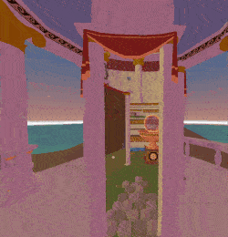
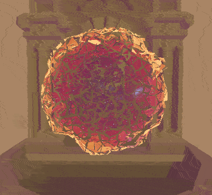
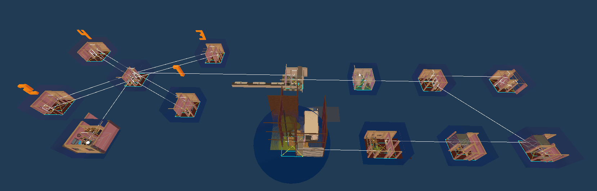
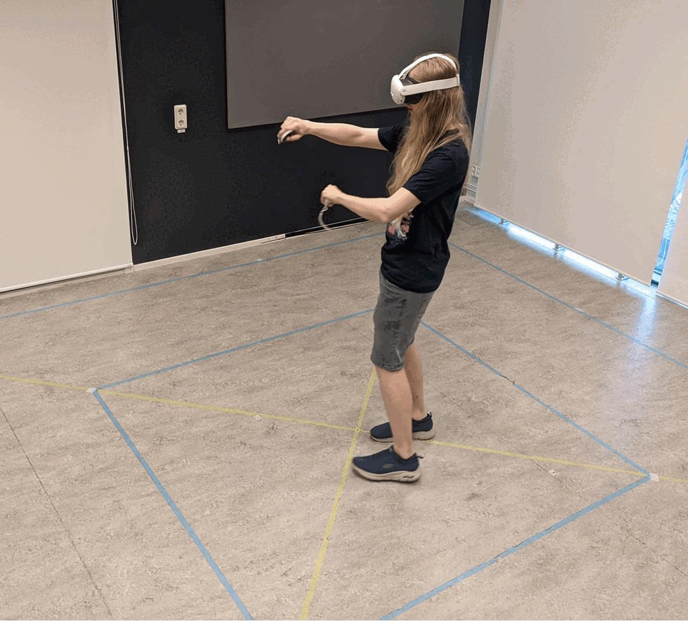
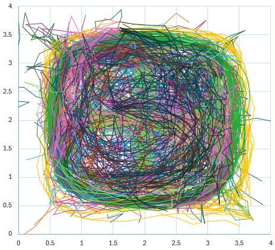

+++
title = 'Non-euclidean VR game with no artificial locomotion using portals'
date = 2024-04-03
draft = false
summary = "A game that had players walk more than a kilomter in real life."
tags = ['Game Development', 'University']
+++

VR puzzle game with a large world, with the idea that you ahve to physically walk everywhere without any artificial movement options such as teleporting or joystick locomotion.
It worked succesfully, as we had playtesters who walked between 1-2km when playing the game, without getting lost or feeling like they had been walking too much.
It is possible through making the game world non-euclidean using portals, meaning if a player is to walk in a circle in real life, they could end up in a different position in the game world.

My responsibilites included shaders/graphics, modifying and fixing the portal system we took from a paper with implementation, tooling, and design and creation of my level.
For graphics, we kept it simple due to having to run on a Quest 3, which is essentially an android phone and isn't super powerful, especially when each portal in view required a new render pass (or portals seen through other portals).
We experimented with outlines, but due to difficulties with the portal addon not passing depth through portals, we decided on a simple stylized lighting, where shadows are hue shifted towards purple to add some visual interest.
We again didn't want to tempt using dynamic lights, as shadow map rendering through portals, while supported, would require even more render passes.

Due to the constraints of the game, there has to be many portals in small enclosed spaces. The addon uses oblique camera matrices to get correct rendering, which is reused for the culling matrix. However, due to a Unity bug that Unity has decided they will not fix, oblique culling matrices don't cull at all.
To fix this, I had to dig deep into the addon to figure out why culling wasn't working, and then I modified it to have it create a simplified culling matrix that was a superset of the bugged oblique matrix, which fixed culling and performance issues in the project.
We also deliberately use a very short far clip plane (probably around 10-20 meters), since all of our rooms are small, and this allows us to cull other rooms by simply placing the rooms further than the far clip plane from eachother in the game world, ensuring we only render the rooms that are visible through portals. 

I also implemented spatial sound for portal, creating a graph between portals to correctly calculate how far each sound source was, and which portal the sound was coming from.
Originally, audio could not travel through portals at all, since rooms are placed arbitrarily in the game world at far distances to allow culling to work.
The spatial portal sound system helped a lot with immersion as e.g. you can hear which portals to go through to reach the soud of a radio.
Using the portal data we had already made from the tooling, I created a graph with distances between portals. By running a custom pathfinding algorithm on this graph, I could calculate the direction to the portal that has the closest path to the sound, and the distance based on the distance of that path.
This allowed me to virtually place all audio sources from other rooms the distance of the path away in the direction of the corresponding portal.

A lot of tooling was needed to create the levels, as every single room has to physically overlap eachother, as they all exist in the same 4x4 meters of physical space.
Tooling was made that could synchronize any object between any amount of rooms, using an ID.
By simply adding the synchronize component to an object, setting it as a child to a room, and giving it an ID, would synchronize it with all other instances with the same ID to be in the exact same postion and rotation relative to the room they are in.
This worked both in editor and in game.
Similarly tools were made for portals, that synchronize as described above (synchronization of portal transoforms is vital for ensuring the physical space stays synchronized with the virtual space), and also display line gizmos showing the connection to the portal on the other side.
Finally, a gizmo of lines is shown in each room, which directly maps to tape we had placed on the floor. This gave us a quick reference to compare the physical space we were sitting in to the game world.

Finally, for playtests, I implemented a script to collect positional data from a playthrough in a CSV file.
It sampled a point any time a player had taken a step (defined by moving some small distance), or moven through a portal, also logging time and room for analyzing if behavior differed between different rooms.
The image shown below shows all walk data from playtests, we could calculate from this data that people walked 1-2km playing the game, and could analyze e.g. the walking speed in different areas and movement patterns.

