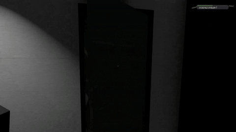
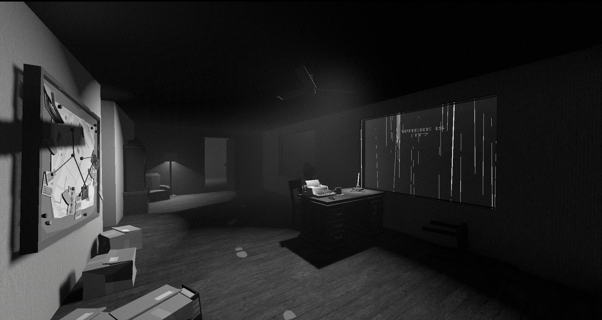

+++
title = 'Combination detective and heist puzzle game with "time travel"'
date = 2024-11-20
draft = false
summary = "Reduced game logic and time into simplified graph allowing reverting anything."
tags = ['Game Development', 'University']

+++

University game project with a larger group in Godot with C# over 8 weeks. Everyone contributed to many aspects of the game, I list my main contributions here.

My biggest contribution is the "time travel system", the game is about figuring out how a crime was carried out, by acting out the crime as the criminal.
As you try out ways the crime could have occurred, and learn new information in form of clues, you have to be able to retrace your steps as the criminal.
I made a system that stores the entire level logic as a graph (what rooms you move through, what you interact with, what doors are open at any given time), and run pathfinding on that graph to ensure the paths you have tried are valid given the information the player has learnt and is assuming.
This then allowed you to retrace your steps by choosing any previous gamestate to return to. It even supported connecting different paths together, though that was cut due to confusion during playtests.

