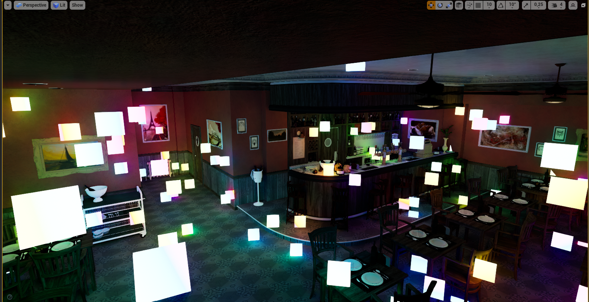
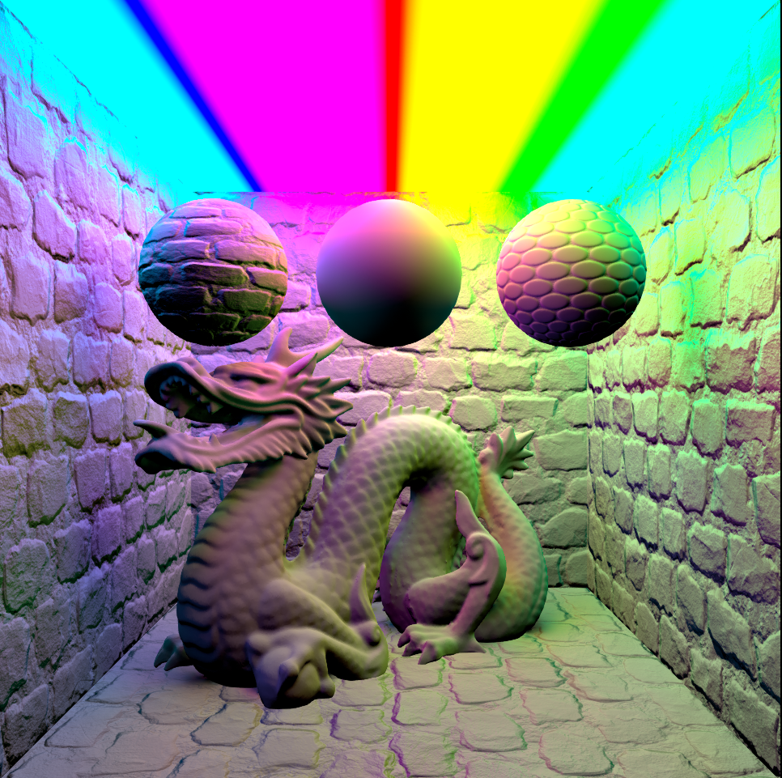
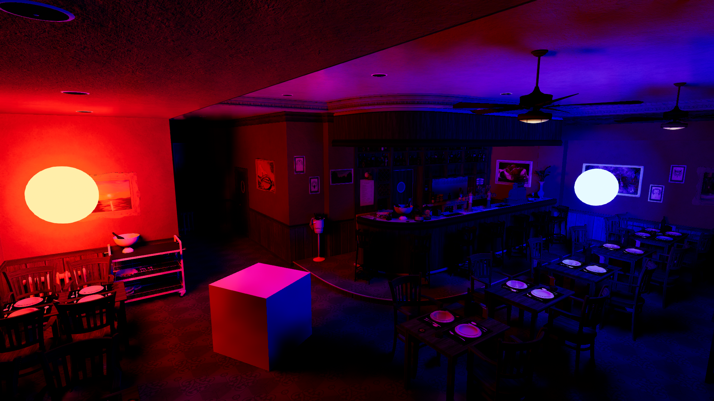
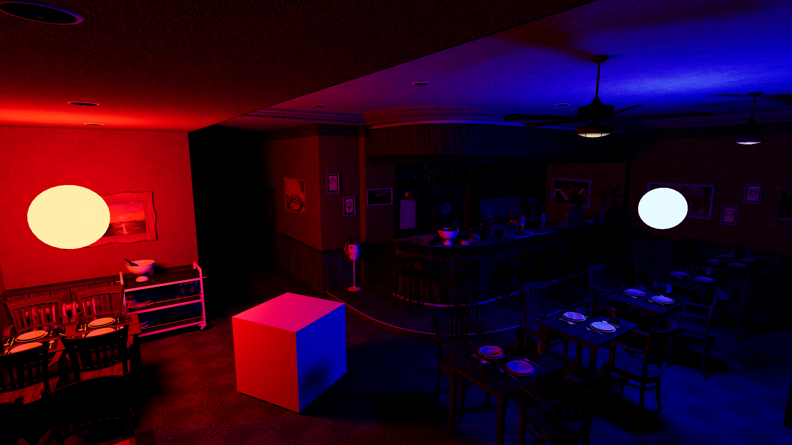
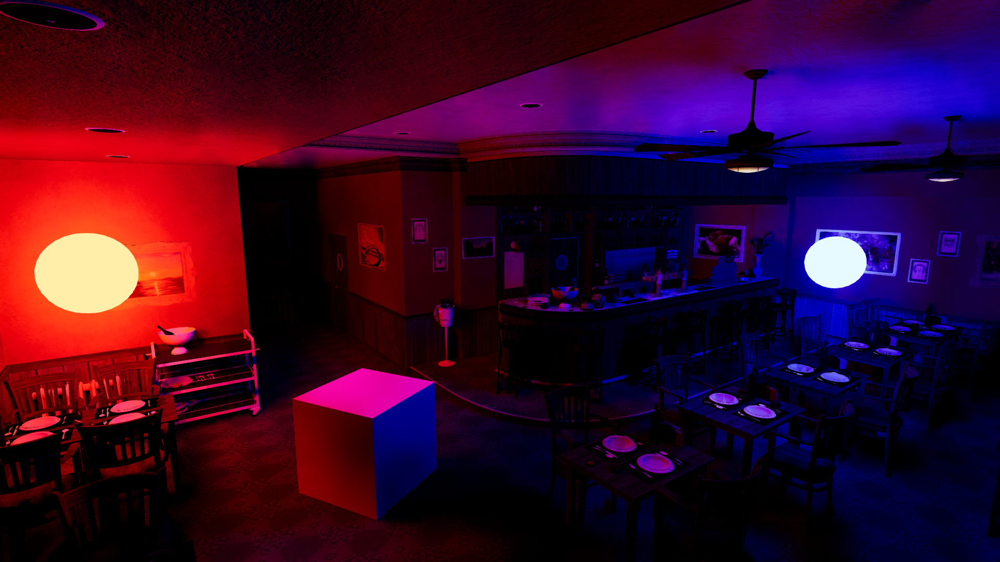
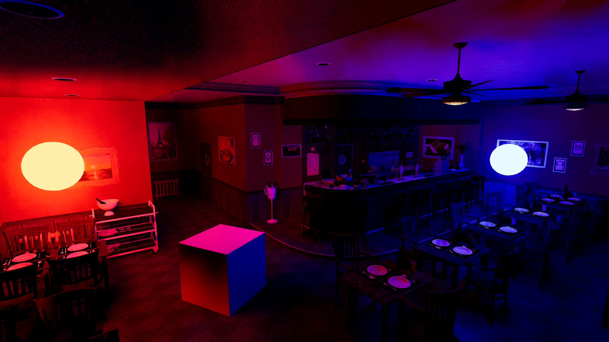

+++
title = 'Masters Thesis on Radiance Cascades SSGI with Box Dragon'
date = 2025-06-26
draft = false
summary = "Real Time Diffuse Global Illumination without Temporal Accumulation"
tags = ['Graphics', 'University']

+++

This was a collaboration with Box Dragon to create global illumination fit for their games.
Using Radiance Cascades and screen-space information, we managed to create convincing dynamic diffuse global illumination in screen-space, running at 6ms on a 9070xt without any temporal accumulation. The fastest performance mode ran at around 2ms though lacked accuracy.
Performance could be significantly improved using temporal accumulation sadly we did not have time to experiment.

A big part of the project was optimization, as we went from an entire second per frame with the proof of concept, down to a few milliseconds per frame. This involved optimizations in the pipeline, algorithm, register pressure, wave intrinsics experiments, and latency hiding. 

Accuracy was important, and throughout we compared to pathtraced results and found in our test scenes screen-space could well approximate pathtracing, assuming relevant info was on-screen as is mostly the case in the game this was designed for.

It scales downwards using multiple settings. The method at lower settings is still more than sufficient for e.g. bounce lighting and some emissive effects, as lighting the scene using solely emission highlights the artifacts here.

It was integrated into Unreal Engine 4 as a plug and play plugin, involving significant work figuring out how to properly hook into Unreal Engines rendering pipeline.
