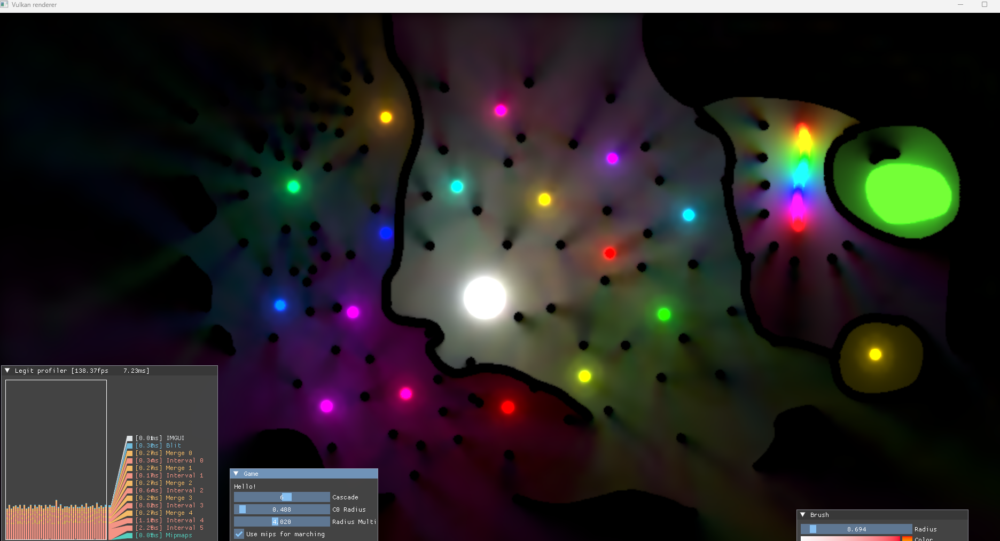
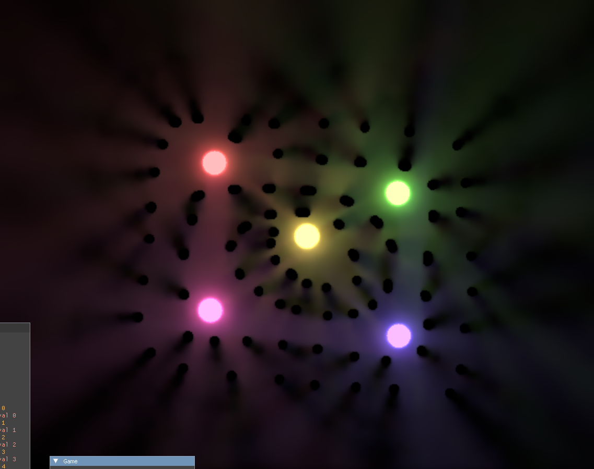

+++
title = 'Radiance Cascades 2D Graphics Course Project'
date = 2025-06-26
draft = false
summary = "2D Real Time Diffuse Global Illumination without Temporal Accumulation"
tags = ['Graphics', 'University']

+++

Solo university project where we could implement a graphics technique of our choice, made with C++ and Vulkan.
It is fully dynamic global illumination in 2D, where you can draw lights and walls with a brush.
I implemented Radiance Cascades in 2D from scratch, and got good real time performance at 1080p on a GTX1070, without any temporal accumulation.
This means it updates instantly.
It contained various optional fixes and optimizations that could be used to dial the performance.
Performance is only dependent on resolution.

Sadly i cannot get the project to build anymore so i couldn't get the final images, these are taken during development, performance and quality is improved and can be varied depending on settings.
The ringing that can be seen can be fixed using extra rays, called the bilinear fix, which was implemented at the cost of performance as an option.

