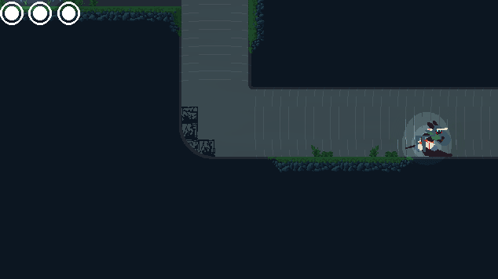

+++
title = 'Codeveloped indie game on Itch.io'
date = 2024-12-20
draft = false
summary = "Contributing Unity rendering modifications, shaders, rope physics, procedural animation, and general support."
tags = ['Game Development', 'Personal Project']

+++
### Roa - Indie Game
Responsible for the many technical systems in the game, such as custom robust performant rope physics with stiffness and friction, modifying the Unity 2D URP pipeline source to achieve the desired lighting with cel shading, various shaders, and tooling.
Made in Unity.

Also seen is simple water simulation for puddles, shaders for basic fog and waterwallfs, and the cel shaded light.

The ropephysics system is very flexible, being used for scondary movement for the boss. The boss animation consists solely of animating key points, namely the hip, torso, and head, with the rest being procedurally moved using the rope physics.

[Roa on itch.io](https://ressii.itch.io/roa "")

This is **bold** text, and this is *emphasized* text.

Visit the [Hugo](https://gohugo.io) website!