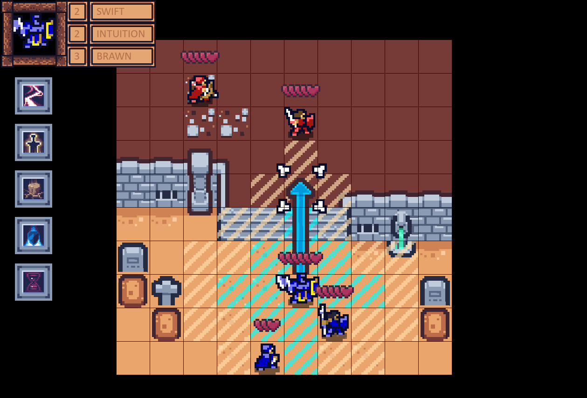
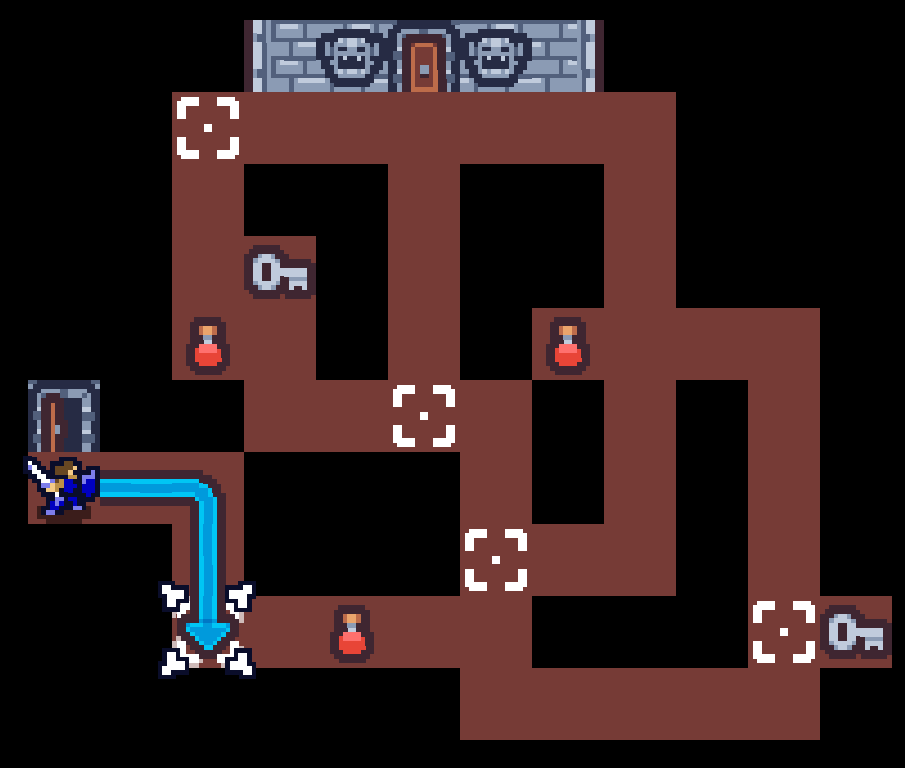
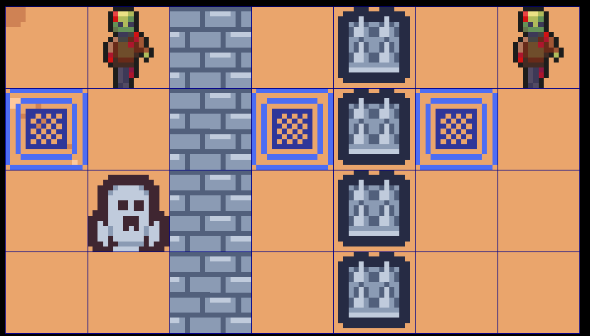

+++
title = 'Tactics game engine with C# and SDL'
date = 2024-04-03
draft = false
summary = "Almost from scratch C# game engine designed for grid based tactics games."
tags = ['Game Development', 'University']
+++
Using SDL and C# we made a game engine that makes it simple to make Tactics games by designing an engine for enqueuing and playing back actions to allow animations to play out easily.
Most of the work was designing systems that were generic enough that any tactics game or similar could be made in it, that it allowed everything to be animated, while keeping it easy to create games in it.

In collaboration we designed a system for how objects and units fit on a grid, "collision" and layers, and how actions are performed and how turns work.

In order to properly animate the actions, each action is enqueued in the system such that they play in the correct order, and can potentially be interrupted. E.g. if you push a unit, the push animation plays, the unit gets pushed one tile at a time, and if they hit a tile while this happens, they take damage or potentially die, ending the turn.

In the around 8 weeks, we made the engine and two demo games, a simple puzzle game and a level based tactics game with a few levels, different unit types, different abilities, stats, and an overworld map.

