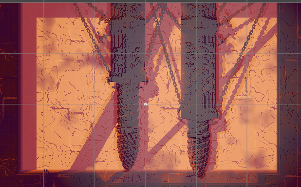
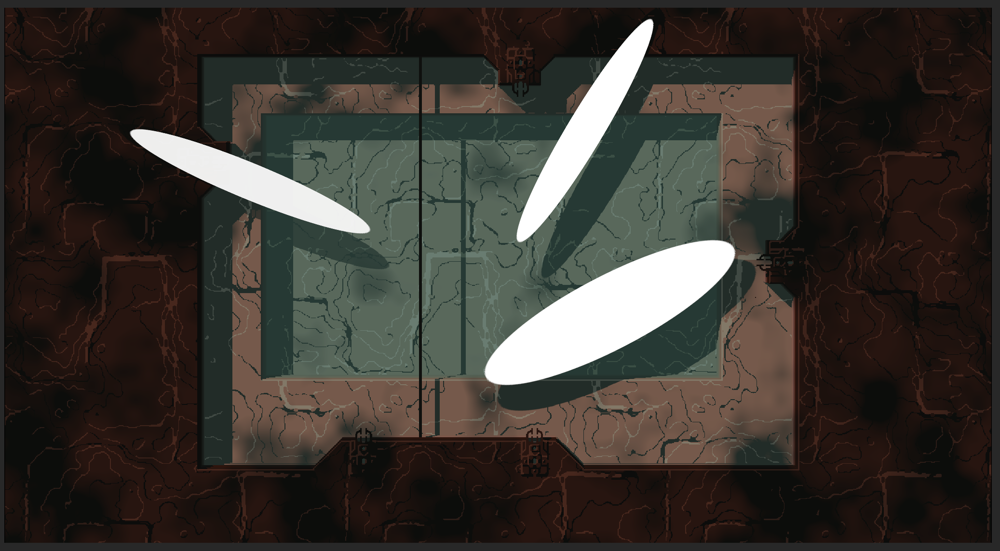
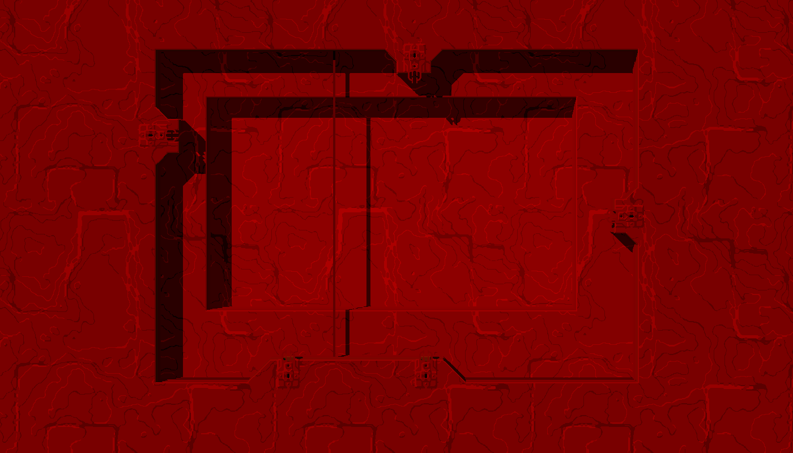
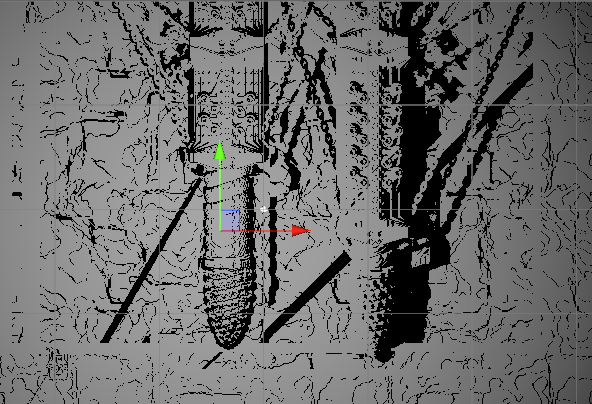
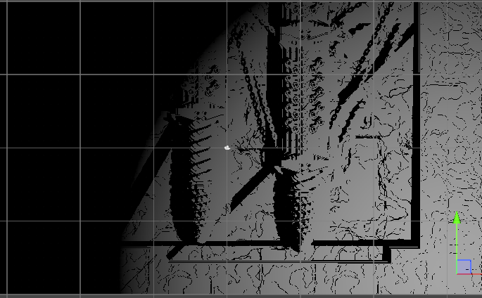

+++
title = 'Rain World Rendering Recreation'
date = 2022-01-01
draft = false
summary = "Recreating efficient 2D palette based renderer with dynamic shadows"
tags = ['Graphics', 'Personal Project']

+++

A project to learn how rendering in Rain World works by recreating it in Unity, using Rain World Assets.
Contains Rain Worlds palette rendering, shadowcasting, and dynamic lights, which were slowly added throughout a long period as I wanted to learn specific aspects of their renderer.

It was made by analyzing how their color palettes work (helpfully described by their community), so I could unpack them in shader.
I impleented lighting based on the very short description posted by the developers on how sun lights work, extending it to work with cloud shadows and point lights.

